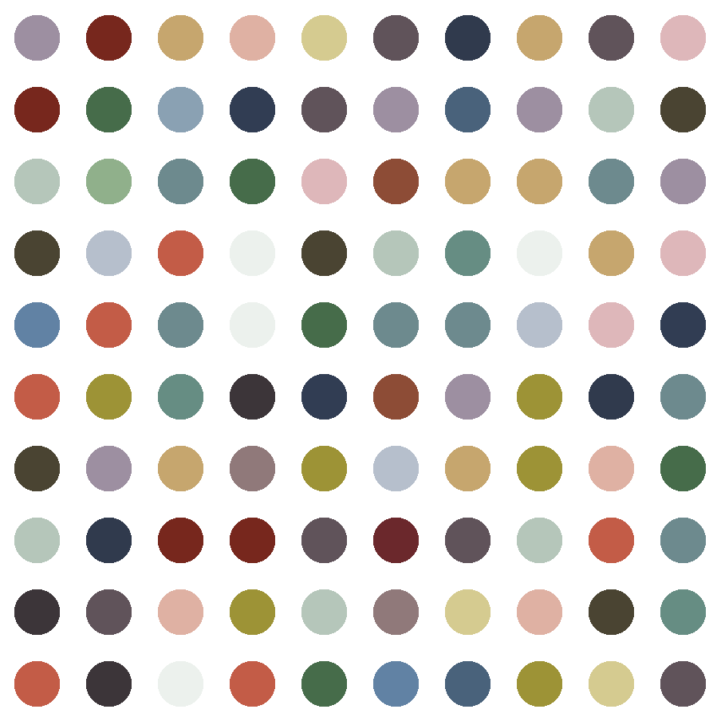
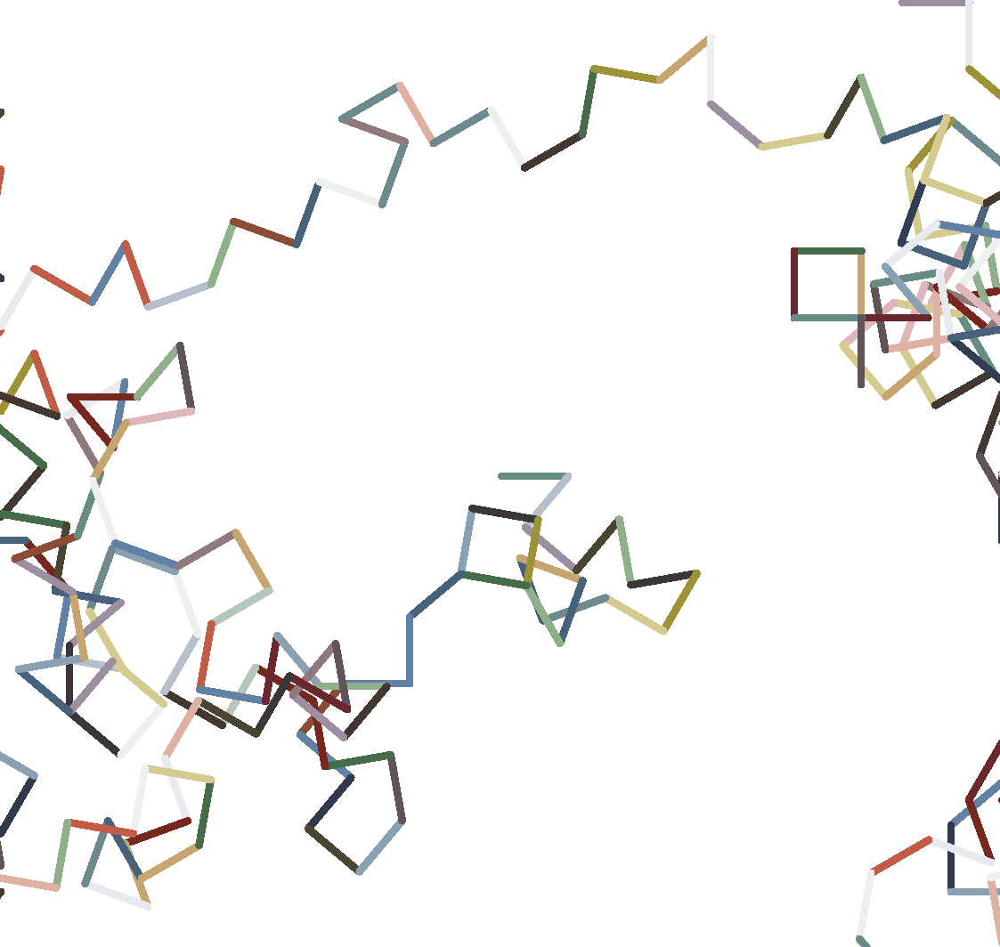
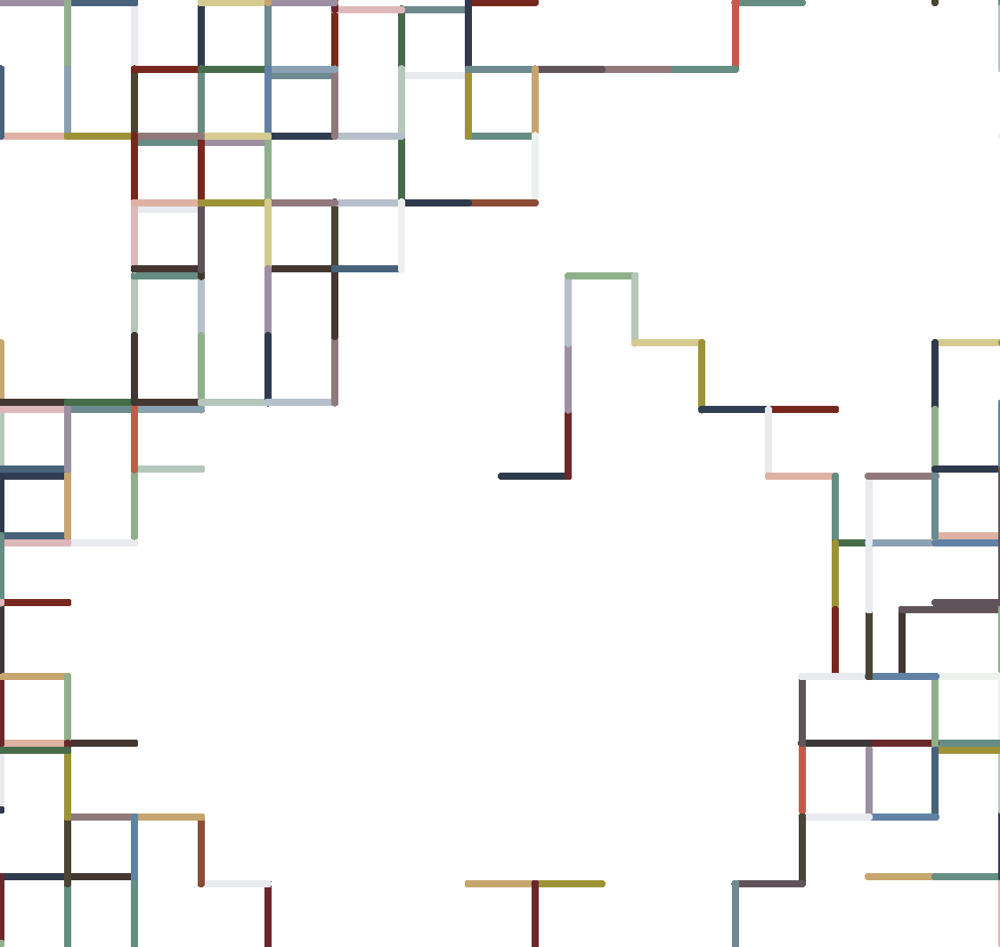

# Random Forest Painting

This Python program generates random art using the Turtle graphics library. It has three different painting modes:
+ Hirst "Dot" Painting (smaller & larger image Versions)
+ Random Forest Diagonal
+ Random Forest Squares

The generated artwork can be saved as a PNG image file. For this, you will need to have GhostScript installed on your system. The program generates the artwork as a PostScript file, which can then be converted to a PNG image file using GhostScript.
[Download Ghostscript here.](https://www.ghostscript.com/) After the installation, add the `bin` and `lib` folder to your path.

You can leave out Ghostscript completely and just use the snipping tool.

```python
# with GhostScript
# in every painting method, there is a function call 'save_painting(screen)', leave it active.
# also at the end there is a 'os.remove(FILE)' statement, leave it active as well.

# inside the painting method:
save_painting(screen)
# at the end of the code
os.remove(FILE)

# without Ghostscript
# deactivate them using the comment syntax
# save_painting(screen)
# os.remove(FILE)
```

## Features

- **Hirst "Dot" Painting**: Generates a colorful artwork consisting of dots arranged in a grid pattern.
- **Random Forest Diagonal**: A random walk pattern with diagonal lines.
- **Random Forest Squares**: This version creates a square pattern.

```python
# Play around with the parameters to create beautiful random walks.

# Random Forest Painting - Diagonal Lines
random_walk_diagonal(line_width=10, speed=0, screen_width=1500, screen_height=1500, walk_range=200,
                     ahead_length=100, back_length=100, right_angle=90, left_angle=50)

# Random Forest Painting - Squares
random_walk_squares(line_width=10, speed=0, screen_width=1500, screen_height=1500, walk_range=400,
                    ahead_length=100)
```

## Usage

1. Make sure you have Python installed on your system.
2. Clone this repository to your local machine.
3. Install the necessary modules if needed.
```python
from turtle import Turtle, Screen
from extract_image import extract
import random
from PIL import Image
import os
```
4. Navigate to the project directory and open `random-forest-painting.py` with your preferred code editor.
5. Choose the desired painting mode by uncommenting the corresponding function call in the code at the end.
```python
# Hirst Dot Painting
# hirst_painting()

# Hirst Dot Painting
hirst_painting()
```
6. Modify the parameters of the function call to customize the artwork.
7. If you want to save the random walk as a .png file, (Ghostscript must be installed), leave the `save_painting()` function active inside the painting method, also leave the `os.remove(FILE)` statement active at the end. If not, comment them out.
8. Run the `random-forest-painting.py` file using Python from your terminal (or in your IDE).
```bash
python random-forest-painting.py
```

## Examples

### Hirst "Dot" Painting




### Random Forest Painting - Diagonal Lines




### Random Forest Painting - Squares




---
# Color Extractor

The Color Extractor program allows you to extract a specified number of colors from an image and store them as RGB tuples. It utilizes the `colorgram` library.

## Usage

1. Ensure you have the `colorgram` library installed.
2. Update the number_of_colors parameter in the `color_extractor()` function to specify the desired number of colors.
3. Replace `"image.jpg"` with the path or filename of the image from which you want to extract colors.
4. Run the program.
5. The extracted colors will be stored as RGB tuples in the `COLOR_LIST` variable.
6. The extracted color data will be saved in a file named `colors-extracted.py`.

```python
import colorgram

# example for extraction of 30 colors
# keep in mind: the most prominent colors are extracted,
# if there is a white background, white will be the most dominant color, 
# and you might want to delete the undesired color tuples.
color_extractor(number_of_colors=30)
```

You can replace the color tuples in `extract_image.py` and use your own color set.
+ `extract-image.py` contains the color set with which the example images were made.

## License
Random-Forest-Painting & Color Extractor are released under the [MIT License](https://opensource.org/licenses/MIT).

**Note:** These programs are provided as-is without any warranty. Use them at your own risk.

## Contributions
Contributions are welcome! If you have any suggestions, improvements, or bug fixes, please submit a pull request or open an issue on the GitHub repository.

Unleash your creativity with Random Forest Painting and generate unique and abstract masterpieces.